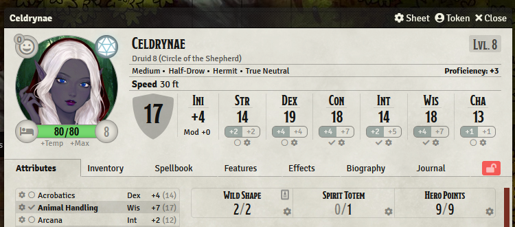

# Optional Rules for D&D5e

This module aims to automate some of the optional and homebrew rules available for DnD 5e. A list of the supported rules is listed down below. Do note that you will still require the original sourcebooks to reference the full set of rules.

This module is created in compliance with WOTC's [fan content policy](https://company.wizards.com/en/legal/fancontentpolicy) 

## Supported Rules

Below is a list of the current rules that the module automates.

- Critical hit and Fumble Rules (DMG).
- Flanking (DMG).
- Hero Points (DMG).

## Dependencies

Some of the optional rules depend on other modules. While it is not required to install all the dependencies, it's recommended to do so. Nonetheless, if you're only using certain rules, you can just install the dependencies for the particular rule.

- LibWrapper --> Required dependency.
- Critical Hit and Fumble --> More Hooks 5e.

## Limitations

- Flanking currently does not support hexes.

## Instructions

### Critical Hit and Fumble Rules.

#### Settings

- Enable Critical Hit/Fumble Rules: Enable usage of Critical Hit/Fumble Rules [ Requires **More Hooke 5e** ].
- Critical Fumble Threshold: Once a crit/fumble is rolled use the threshold a d6 to determine if the actual table is rolled on or not. Default is 1.
- Hide Critical Hit/Fumble Card: Hide the drawn card from all users except the GM(s).
- Main Critical Hit Rolltable: Specify the default crit rolltable. (Table needs to be imported into the world.)
- Main Fumble Rolltable: Specify the default fumble rolltable. (Table needs to be imported in the world.)
- Melee Critical Hit Rolltable: Specify the melee crit rolltable. _Overrides main crit table if set._ (Table needs to be imported into the world.)
- Melee Fumble Rolltable: Specify the melee fumble rolltable. _Overrides main fumble table if set._ (Table needs to be imported into the world.)
- Spell Critical Hit Rolltable: Specify the spell crit rolltable. _Overrides main crit table if set._ (Table needs to be imported into the world.)
- Spell Fumble Rolltable: Specify the spell fumble rolltable. _Overrides main fumble table if set._ (Table needs to be imported into the world.)

#### Caveats

- On a critical hit or fumble a d6 is rolled. If the result is above a certain threshold _(Can be changed in settings)_ the chosen rolltable is rolled on _(Can be changed in settings)_.

### Flanking

#### Settings

- Enable Flanking Automation: Enable usage of Flanking Rules and Automation. [ Works with both betterRolls and Midi. ]
- **[ Experimental ]** Flank across creature sizes: Allow flanking automation if the attacker and the flanking ally are of different sizes. This is experimental and set to false as a default due to the nature of grids and calculating the exact square. The automation works 95+% of the time accurately though it might give false positives on a large difference between the size of the attacker and the flanker.
- Variant Rule - Use Modifier: Use a modifier for the flanking bonus instead of granting advantage to the attacker.
- Flanking Modifier - Modifier to use when using the "variant - use modifier" rule. The default modifier is set to 2. _(Currently only numbers are supported)_
- Flank based on creature size: Restrict the size of the creature that can be flanked. Setting this will disable automation when targetting a creature greater than the size set.

#### Caveats and Information

- **_It is recommended to install either Easy Target or Smart Target to easily target enemies._**
- The flanking subsystem requires the attacker to first target the enemy. Once targeted the module will calculate if the attacker is flanking a creature. If the attacker or target moves after targeting the creature, the attacker must then untarget and retarget the creature again to determine if they are still flanking.
- Flanking can be restricted to certain size categories and below.
- Flanking can either grant adv on the attack or a situational bonus. _(Numbers Only)_

### Hero Points

#### Settings

- Enable Hero Points Automation: Enable usage of the Hero Point System.

#### Caveats

- **[ Warning!! ]** The Hero Point system takes over the tertiary resource value. Any resource set up on the tertiary node will be overridden by the hero points value.

## Installation Guide

Paste the following link in the install module section of foundry.
https://github.com/NekroDarkmoon/optional-rules-dnd5e/releases/latest/download/module.json

## Support

Consider buying me a coffee if you like my work. [https://ko-fi.com/nekrodarkmoon](https://ko-fi.com/nekrodarkmoon)
